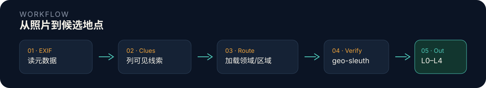

<p align="center">
  
</p>

# Searching-skill · 网络迷踪判读规则库

给 AI 助手用的**看图定位**知识库：从照片可见线索推断「这是什么」「这里是哪」，再用 [`geo-sleuth`](geo-sleuth/SKILL.md) 做数值核验。

| 层 | 回答 | 组织 | 规模 |
|---|---|---|---|
| **元素层** | 这是什么 | 24 个领域 | 2,807 条 |
| **区域层** | 这里是哪 | 161+ 个国家/省份 | 23,370 条 |
| **合计** |  |  | **26,177 条** |

路由表见 [`INDEX.md`](INDEX.md)；流程与证据框架见 [`docs/`](docs/)。

---

## 规则长什么样

元素层统一为 `线索 → 结论`：左边是照片里**能看见/能查到**的特征，右边是**能推断出的信息**。

```
列车座椅固定朝向行驶方向 → 乘客面向的方位即列车行驶方向
车次以 G 开头 → 高速铁路；以 D 开头 → 动车组线路
太阳能电池板安装方向 → 北半球通常朝南
无柱雨棚 → 车站等级高、规模大
```

区域层按区域罗列特征，节名形如 `大区 > 子区域`：

```
## 关东地方 > 电线杆标牌
- 关东标牌常常为银色的竖牌，带有手写的文字
- 标牌上的排版格式为上方的横写文字，以及下方竖写的三位数字
```

---

## 怎么用

把 `Searching-skill/` 整个目录复制到你所用助手的技能目录，然后**直接发一张照片**：

| 运行环境 | 技能目录（示例） |
|---|---|
| Claude Code / Codex 兼容助手 | 该产品的 agent skills 目录（见各产品文档） |
| Cursor | 项目级或用户级 skills 目录 |
| Hermes | Windows：`%LOCALAPPDATA%\hermes\skills`；Linux/macOS：`~/.hermes/skills` |

```bash
cp -r Searching-skill <你的技能目录>/Searching-skill
```

装好后有 **总技能 + 区域层 + 元素领域 + 核验层**。助手按需读取同级 `SKILL.md`（或 Hermes `skill_view`）：

| 技能名 | 内容 |
|---|---|
| [`wlmz`](SKILL.md) | 总技能：读图 → 提线索 → 路由 |
| [`wlmz-region`](region/SKILL.md) | **区域定位**：按国家/省份比对 |
| `wlmz-yun` / `wlmz-shengwu` / … | 云识读、生物线索等元素领域（见 [`INDEX.md`](INDEX.md)） |
| [`geo-sleuth`](geo-sleuth/SKILL.md) | **核验层**：太阳影子、OSM、反解机位、证据图 |

```bash
# 可选：本地一键分流（EXIF → OCR → 识图 → 技能遍历）
py geo-sleuth/scripts/triage.py 图.jpg
```

---

## 怎么工作

<p align="center">
  
</p>

助手会先查 EXIF，再提取线索，按 [`INDEX.md`](INDEX.md) 加载相关领域判读「这是什么」；需要定地点时再加载 [`wlmz-region`](region/SKILL.md)；数值核验走 [`geo-sleuth`](geo-sleuth/SKILL.md)。置信度与证据写法见 [`docs/证据与置信度框架.md`](docs/证据与置信度框架.md)，技能之间如何交接见 [`docs/技能互联·产出手册.md`](docs/技能互联·产出手册.md)。

---

## 目录结构

仓库根目录为 **`Searching-skill`**。文件夹用英文；Markdown 条目与国家/省份**文件名**仍为中文，便于检索。

```
Searching-skill/
├── SKILL.md                 总技能（读图 → 提线索 → 路由）
├── INDEX.md                 线索关键词 → 领域目录
├── docs/                    总流程手册、证据框架
├── reverse-image/ …         24 个元素领域（各含 SKILL.md）
├── geo-sleuth/              核验层（脚本 + 参照）
├── image-search-mcp/        自动识图 MCP
└── region/                  区域定位（按需读取，不占上下文）
    ├── SKILL.md
    └── references/
        ├── world/           132 个国家
        ├── china/           省市特征
        └── elements/        跨国主题
```

技能 YAML 的 `name:` 仍为 `wlmz` / `wlmz-*`（历史 id，与文件夹名独立）。区域层用 `references/` 而非独立技能，避免把全部国家文件塞进上下文。

<details>
<summary>文件夹中英对照</summary>

| 英文目录 | 原中文名 | 说明 |
|---|---|---|
| `Searching-skill/` | 网络迷踪 | 项目根 |
| `reverse-image/` | 识图工具 | 反向搜图、平台识图 |
| `maps-streetview/` | 地图与街景 | 卫星图、街景、历史影像 |
| `lighting-astronomy/` | 光影天文 | 影子、太阳方位、高度角 |
| `night-sky/` | 星空 | 星座、南北半球星象 |
| `weather-climate/` | 天气气候 | 云雨气候带 |
| `cloud-reading/` | 云识读 | 云种、晕、霞、地理约束 |
| `bio-clues/` | 生物线索 | 树种、作物、家畜、野生动物 |
| `architecture/` | 建筑风格 | 屋顶、民居、立面 |
| `railways/` | 铁路高铁 | 动车、接触网、站台 |
| `metro/` | 地铁 | 站台门、线路色、换乘 |
| `buses/` | 公交 | 涂装、站牌、车身 |
| `aviation/` | 航空航班 | 机型、机场 |
| `ships/` | 轮船 | 船型、船籍 |
| `license-plates/` | 车牌 | 号牌底色与格式 |
| `language-script/` | 人文文字 | 语种、招牌、文字系统 |
| `crypto-ciphers/` | 密码与加密 | 编码、摩斯、隐写、解密 |
| `infrastructure/` | 基建 | 电杆、路灯、电网 |
| `landforms/` | 地理地貌 | 地形、海岸、土壤 |
| `everyday-knowledge/` | 生活常识 | 货币、饮食、计量 |
| `tuxun/` | 图寻 | 题库与猜国规则 |
| `methodology/` | 解题方法论 | 流程、互证、排除 |
| `news/` | 新闻热点 | 时事、赛事 |
| `culture/` | 文化 | 民俗、宗教、节庆 |
| `spatiotemporal-culture/` | 时空文化 | 节庆穿戴、反推拍摄时点 |
| `phone-attribution/` | 号码归属 | 门头电话、号段、查号 |
| `geo-sleuth/` | 核验层 | 太阳计算、OSM、机位、证据图 |
| `image-search-mcp/` | 自动识图 | Lens/百度/必应引擎 |
| `region/` | 区域定位 | 国/省比对层 |

</details>

---

## 规模一览

### 区域层

| 分区（目录） | 文件 | 线索 |
|---|---:|---:|
| 世界 `world/` | 132 | 14,101 |
| 中国 `china/` | 22 | 7,175 |
| 元素 `elements/` | 11 | 2,094 |
| **合计** | **165** | **23,370** |

线索最多的区域：

| 区域 | 线索 | 区域 | 线索 |
|---|---:|---|---:|
| world/印度尼西亚 | 1422 | world/俄罗斯 | 873 |
| china/重庆 | 708 | china/上海 | 665 |
| world/尼日利亚 | 641 | world/南非 | 588 |
| china/天津 | 579 | china/中国通用 | 552 |
| china/中国出租车 | 535 | world/西班牙 | 502 |

完整分区索引：[`region/references/_index.md`](region/references/_index.md)。

### 元素层

| 领域（目录） | 条数 | 领域（目录） | 条数 |
|---|---:|---|---:|
| 地图与街景 `maps-streetview/` | 471 | 地理地貌 `landforms/` | 85 |
| 铁路高铁 `railways/` | 351 | 天气气候 `weather-climate/` | 84 |
| 人文文字 `language-script/` | 238 | 云识读 `cloud-reading/` | 78 |
| 识图工具 `reverse-image/` | 210 | 车牌 `license-plates/` | 50 |
| 解题方法论 `methodology/` | 206 | 密码与加密 `crypto-ciphers/` | 38 |
| 光影天文 `lighting-astronomy/` | 172 | 生活常识 `everyday-knowledge/` | 38 |
| 航空航班 `aviation/` | 156 | 轮船 `ships/` | 22 |
| 公交 `buses/` | 129 | 新闻热点 `news/` | 20 |
| 建筑风格 `architecture/` | 129 | 文化 `culture/` | 19 |
| 地铁 `metro/` | 97 | 星空 `night-sky/` | 12 |
| 基建 `infrastructure/` | 96 | 图寻 `tuxun/` | 6 |
| 生物线索 `bio-clues/` | 35 | | |
| **合计** | **2,807** | | |

> `bio-clues` 计技能正文中的 `线索 → 结论`；跨国植被细表见 [`region/references/elements/`](region/references/elements/)，已计入区域层「元素」分区。

---

## 使用须知

- 线索多为**倾向性规律**（「常见/多为」），不是绝对判据。单条线索通常不足以定位到具体地点。
- **至少用两个独立线索互相印证**再下结论。同一线索在不同地区可能有相反含义。
- 套用线索前先核对限定条件（季节、半球、街拍年份），条件不符时规律可能反转。
- 只依据照片中**实际可见**的内容推理，不臆造线索。
- 区域层**保留具体地名**（州名、公路编号）——这是定位必需的对照点，与元素层「去地名」策略相反。
- 图片未随包分发（体积所限）。本包是纯文本，图片路径引用仅作定位提示。
